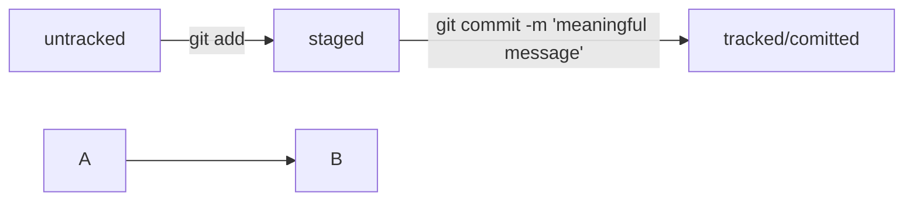

# The ultimate git guide for old dudes

## 1. Your first move
Install Git for your OS.
Check installation.

```
git version
```

## 2. Set up .gitconfig
From anywhere:

```
git config --global user.name "put_your_name_here"
```

```
git config --global user.email "put_your_email_here"
```

To check changes

```
git config --list
```

or

```
cat ~/.gitconfig 
```

## 3. Initialize your local repository
**Go to project catalog**

```
mkdir my_project_name
cd my_project_name
git init
``` 

Check this action by:

```
git status
```
 
## 4. Create what you need
Make some stuff **in project catalog**.

## 5. Add those files to your repo
To do this, go to the project catalog 

```
git add --all
``` 

or command to add current catalog:

```
git add .
``` 

Command to add specific file:

```
git add file_name
```
 
After changing something in files you have to 

```
git add
```
 
again

## 6. Commiting changes 
Only after this command you save the changes 

```
git commit -m 'short description of change'
```

## 7. Checking
If you want to check the history of commits, use

```
git log
```

## 8. Create remote repo
VIA [GitHub](https://www.github.com "remote repo")

Than create my_project_name repo

After this step we will our connect our local repo to remote repo on GitHub.

But first of all we are going to make SSH-keys

## 9. SSH keys
You don't have to do this, but linking you local pero to remote repo VIA SSH will make your life easier.
Word.

### 9.1 Check if SSH_keys allready exists

```
ls -la .ssh/ 
```

Delete if there are any you have not created.

### 9.2 Generate new pair of SSH-keys

``` 
ssh-keygen -t ed25519 -C "email linked to your GitHub"
```

or use another algorythm if you see an error message:

```
ssh-keygen -t rsa -b 4096 -C "email linked to your GitHub"
```

### 9.3 Choose plase to store your keys
After this you will see a pair of files in choosen directory.

And you will be asked about creating code phrase. 
This can be skiped. Otherwise you will have to enter this phrase with every commit.

Then check keys:

```
ls -lah ~/.ssh
```

Two files will appear. One of them is .pub. It means public.

Other one is private. **No one should see it!**

### 9.4 Linking SSH-key whith GitHub
Copy the internals of .pub file into buffer

```
pbcopy < ~/.ssh/id_rsa.pub
```

or

```
pbcopy < ~/.ssh/id_ed25519.pub
```

or

```
cat ~/.ssh/id_ed25519.pub
```

On Windows use 'clip' instead of 'pbcopy'
And copy output using alt+shift+c
Then go to **Settings** in GitHub's account.
Click "SSH and GPG keys". Then click "New SSH key".

In "Title" field spell key's name. "Personal key" for example.

"Key type" field must be "Authentication Key".

Into field "Key" paste your **public key** from buffer.

Press "Add SSH key".

### 9.4 Checking correctness.

```
ssh -T git@github.com
```
 
If this is yor **first time**, you'll see

```bash
The authenticity of host 'github.com (140.82.121.4)' can't be established. ED25519 key fingerprint is SHA256:+DiY3wvvV6TuJJhbpZisF/zLDA0zPMSvHdkr4UvCOqU. This key is not known by any other names. Are you sure you want to continue connecting (yes/no/[fingerprint])?
```

Enter "Yes".

## 10. Linking our local repo with our remote repo.
Go to your remote repo's page on GitHub. Choose type "SSH". And copy an URL.

From **your local repo folder** 

```
git remote add origin git@github.com:%account_name%/project_name.git
```

In this command you give two parameters: remote repo's name and it's URL.

Meaning: "origin" - name, "git@github.com:%account_name%/project_name.git" - URL you copied.

Check link between two repos:

```
git remote -v
``` 

## 11. Push, baby, push.
It's time to deliver local file to remote repo.

In your **first time** do it like this:

```
git push -u origin main
```

After first time this would be enough:

```
git push
``` 

## 12. File life cycle in Git



