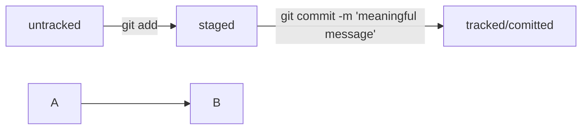

# The ultimate git guide for old dudes

## 1. Your first move
Install Git for your OS.
Check installation.

```
git version
```

### 1.1 Set up .gitconfig
From anywhere:

```
git config --global user.name "put_your_name_here"
```

```
git config --global user.email "put_your_email_here"
```

To check changes

```
git config --list
```

or

```
cat ~/.gitconfig 
```

## 2. Initialize your local repository
**Go to project catalog**

```
mkdir my_project_name
cd my_project_name
git init
``` 

Check this action by:

```
git status
```
 
## 3. Create what you need
Make some stuff _in project catalog_.

## 4. Add those files to your repo
To do this, go to the project catalog and 
print this
to add all the files

```
git add --all
``` 

or command to add curren catalog:

```
git add .
``` 

Command to add specific file:

```
git add file_name
```
 
### 4.1 Important note
After changing something in files you have to 

```
git add
```
 
again

## 5. Commiting changes 
Only after this command you save the changes 

```
git commit -m 'short description of change'
```

### 5.1 Note
If you want to check the history of commits, use

```
git log
```

## 6. Create remote repo
VIA GitHub account

 
[GitHub](https://www.github.com "remote repo")
Than create my_project_name repo


after this step we will connect remote repo on GitHub with our local repo.
But first of all we make SSH-keys

## 7. SSH keys
You don't have to do this, but linking you local pero to remote repo VIA SSH will make your life easier.
Word.

### 7.1 Check if SSH_keys allready exists

```
ls -la .ssh/ 
```

Delete if there are any you have not created.

### 7.2 Generate new pair of SSH-keys

``` 
ssh-keygen -t ed25519 -C "email linked to your GitHub"
```

or use another algorythm if you see an error message:

```
ssh-keygen -t rsa -b 4096 -C "email linked to your GitHub"
```

### 7.3 Choose plase to store your keys
After this you will see a pair of files in choosen directory.

And you will be asked about creating code phrase. 
This can be skiped. Otherwise you will have to enter this phrase with every commit.

Then check keys:

```
ls -lah ~/.ssh
```

Two files will appear. One of them is .pub. It means public.

Othe one is private. **No one should see it!**
## 8. File life cycle in Git



